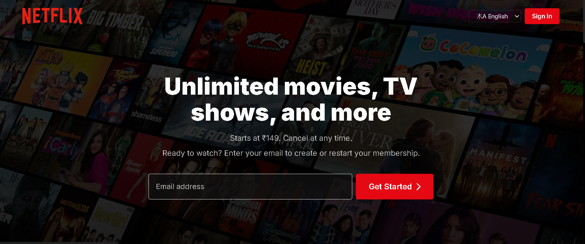
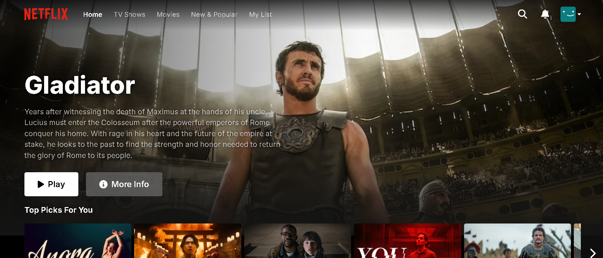
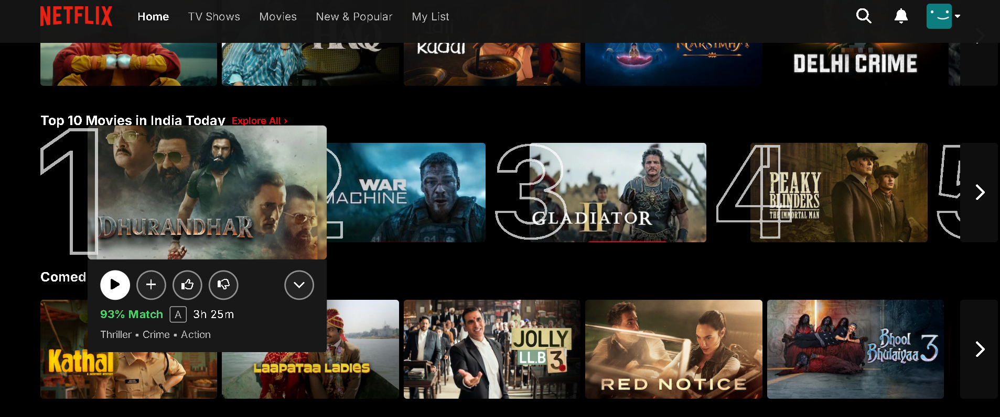
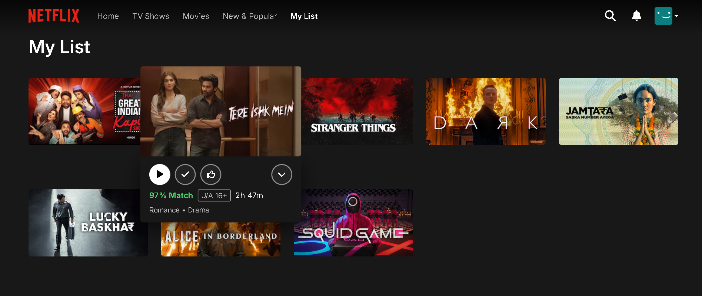
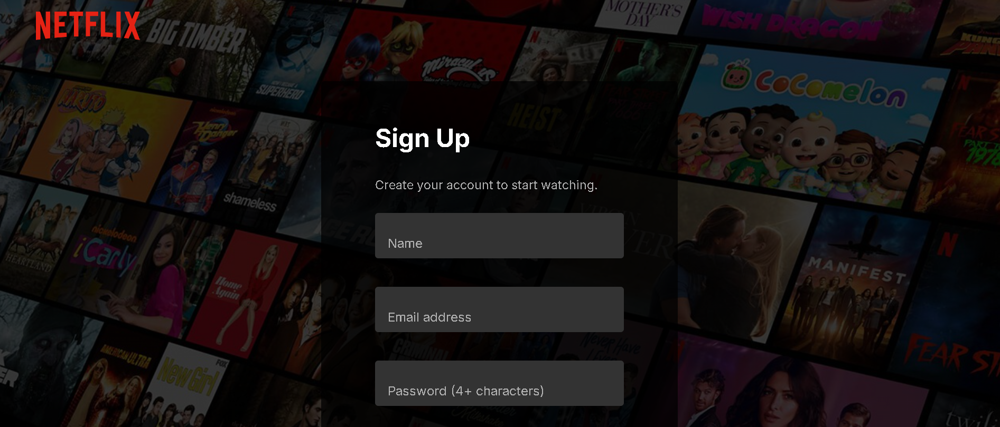

# 🎬 Netflix Clone

A fully responsive Netflix-inspired web application built using **HTML, CSS, and JavaScript (DOM manipulation)**.  
This project replicates the core UI and interactive experience of Netflix, including homepage, movie browsing, hover effects, and user list features.

---

## 🚀 Features

- 🔥 Modern Netflix-like UI
- 🎥 Dynamic movie sections (Top Picks, Trending, etc.)
- 🎯 Hover effects with detailed movie info
- 📃 “My List” page UI
- 🔐 Sign Up / Login page UI
- 📱 Responsive design
- ⚡ Smooth DOM-based interactivity

---

## 📸 Screenshots

### 🏠 Landing Page


### 🎞️ Home Page


### 🎯 Hover Effect


### 📌 My List Page


### 🔐 Sign Up Page


---

## 🛠️ Tech Stack

- **HTML5** – Structure
- **CSS3** – Styling (Flexbox, Grid)
- **JavaScript (DOM)** – Interactivity

```

---

## ⚙️ How to Run Locally

1. Clone the repository:
```bash
git clone https://github.com/Anurag-kashyap-2205/Netflix_Clone
```

2. Navigate into the project:
```bash
cd netflix-clone
```

3. Open in browser:
- Simply open `index.html`

---

## 🎯 Key Functionalities

- DOM-based UI updates
- Interactive movie cards with:
  - ▶️ Play button
  - ➕ Add to list
  - 👍 Like / 👎 Dislike
- Smooth hover animations
- Multi-page navigation

---

## 📌 Future Improvements

- 🔗 Backend integration (Node.js, MongoDB)
- 🔐 User authentication
- 🎬 Movie API integration (TMDB)
- ❤️ Functional “My List” storage
- 🌙 Dark/Light mode toggle

---

## 🙌 Acknowledgements

- Inspired by Netflix UI/UX
- Built for frontend practice

---

## 📬 Contact

- GitHub: https://github.com/anurag-kashyap-2205
- LinkedIn: https://www.linkedin.com/in/anurag-kashyap-a583a9325/

---

## ⭐ Show Your Support

Give a ⭐ if you like this project!